# 📖 MANUAL DE USUARIO - ODONTOLOGYBD
## Sistema de Gestión de Clínica Dental

**Versión:** 1.0  
**Fecha:** Noviembre 2025  
**Idioma:** Español

---

## 1. Introducción al Sistema

### 1.1 ¿Qué es OdontologyBD?

OdontologyBD es un sistema web completo para la gestión de clínicas dentales que permite administrar pacientes, citas, tratamientos, inventario de materiales y relaciones con laboratorios dentales.<cite/>

### 1.2 Requisitos del Sistema

- Navegador web moderno (Chrome, Firefox, Edge, Safari)
- Conexión a Internet
- Resolución mínima de pantalla: 1024x768

---

## 2. Interfaz Principal del Sistema

### 2.1 Plantilla Base (Template)

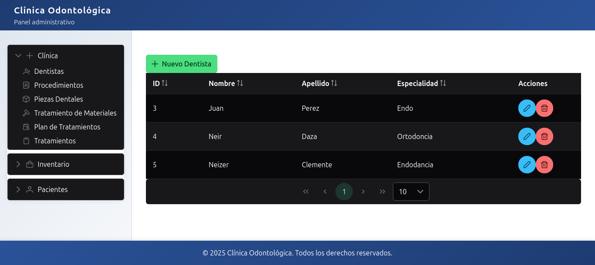

La interfaz del sistema se compone de:

1. **Menú Lateral Izquierdo**: Navegación principal organizada en tres secciones
2. **Área de Contenido**: Zona principal donde se muestran las tablas y formularios
3. **Barra Superior**: Título de la sección actual

### 2.2 Estructura del Menú de Navegación

El menú lateral está organizado en tres categorías principales:

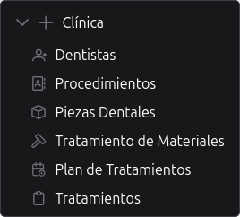 

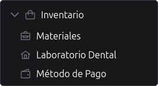 

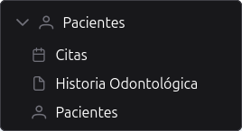 

---

## 3. Módulo de Clínica

### 3.1 Gestión de Dentistas

#### 3.1.1 Listar Dentistas

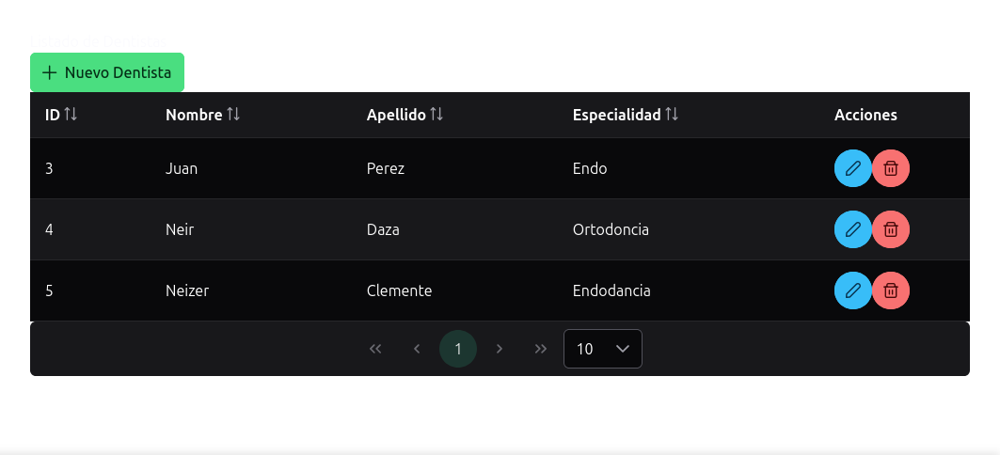  

**Funcionalidades:**
- Ver lista completa de dentistas registrados
- Ordenar por cualquier columna (ID, Nombre, Apellido, Especialidad)
- Paginación (10, 25 o 50 registros por página)
- Botones de acción: Editar (ícono lápiz) y Eliminar (ícono papelera)

#### 3.1.2 Crear Nuevo Dentista

**Pasos:**
1. Hacer clic en el botón "Nuevo Dentista" (verde, con ícono +)
2. El sistema redirige a `/dentists/new`

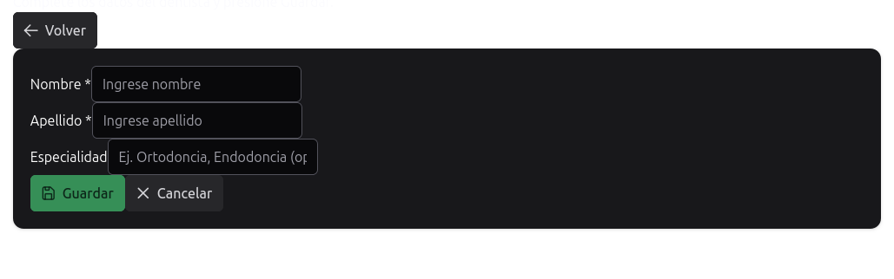  

**Campos del formulario:**
- **Nombre** (obligatorio)
- **Apellido** (obligatorio)
- **Especialidad** (opcional)

3. Completar los campos requeridos
4. Hacer clic en "Guardar"
5. El sistema muestra un mensaje de éxito y regresa a la lista

#### 3.1.3 Editar Dentista

**Pasos:**
1. En la lista de dentistas, hacer clic en el botón de editar (ícono lápiz azul)
2. El sistema carga el formulario con los datos actuales

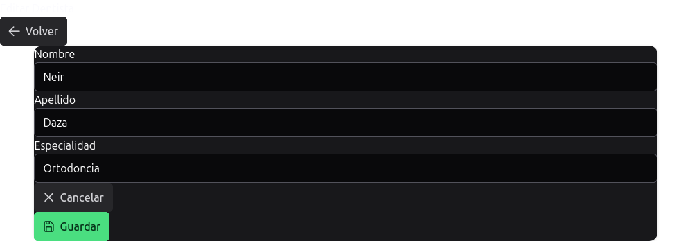  

3. Modificar los campos deseados
4. Hacer clic en "Guardar"
5. El sistema actualiza el registro y muestra mensaje de éxito

#### 3.1.4 Eliminar Dentista

**Pasos:**
1. En la lista, hacer clic en el botón de eliminar (ícono papelera rojo)
2. El sistema muestra un diálogo de confirmación

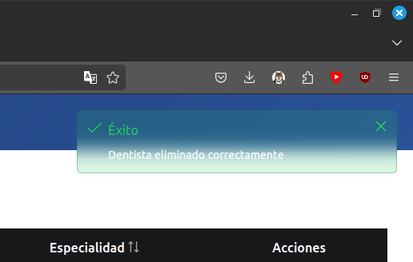  

3. Confirmar la eliminación
4. El registro se elimina y se muestra mensaje de éxito

---

### 3.2 Gestión de Procedimientos

#### 3.2.1 Listar Procedimientos

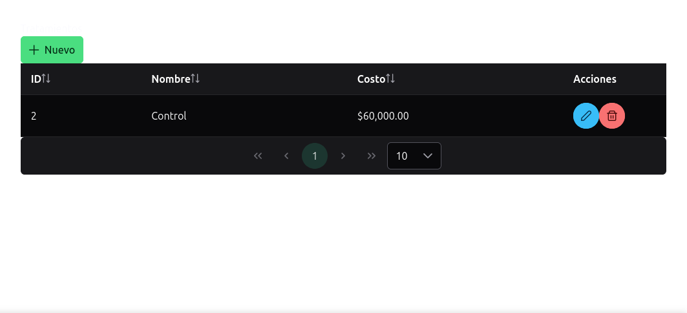  

#### 3.2.2 Crear Nuevo Procedimiento

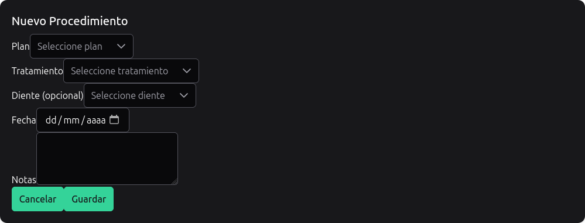 

**Campos del formulario:**
- **Plan** (obligatorio) - Selector desplegable
- **Tratamiento** (obligatorio) - Selector desplegable
- **Diente** (opcional) - Selector desplegable
- **Fecha** (obligatorio) - Selector de fecha
- **Notas** (opcional) - Área de texto

---

### 3.3 Gestión de Piezas Dentales

#### 3.3.1 Listar Piezas Dentales

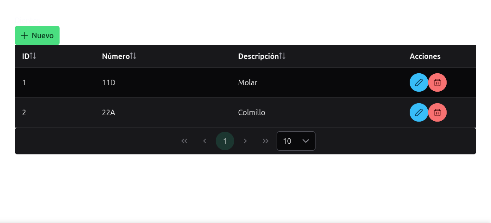  

#### 3.3.2 Crear Nueva Pieza Dental

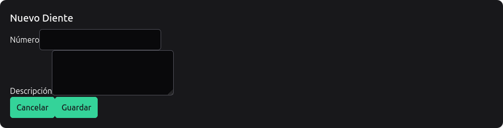  

---

### 3.4 Gestión de Tratamiento de Materiales

#### 3.4.1 Listar Tratamientos de Materiales

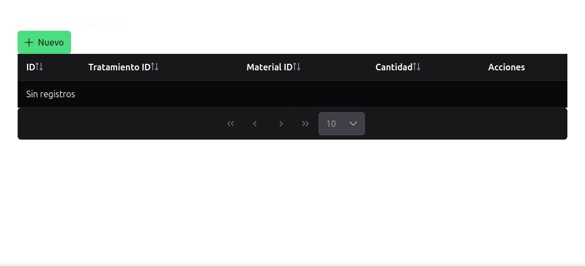  

---

### 3.6 Gestión de Tratamientos

#### 3.6.1 Listar Tratamientos

  

#### 3.6.2 Crear Nuevo Tratamiento

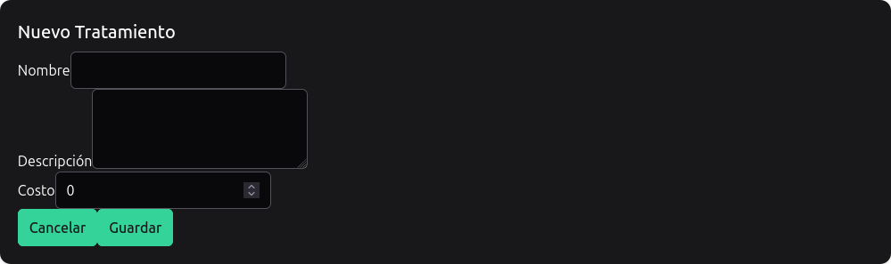  

---

## 4. Módulo de Inventario

### 4.1 Gestión de Materiales

#### 4.1.1 Listar Materiales

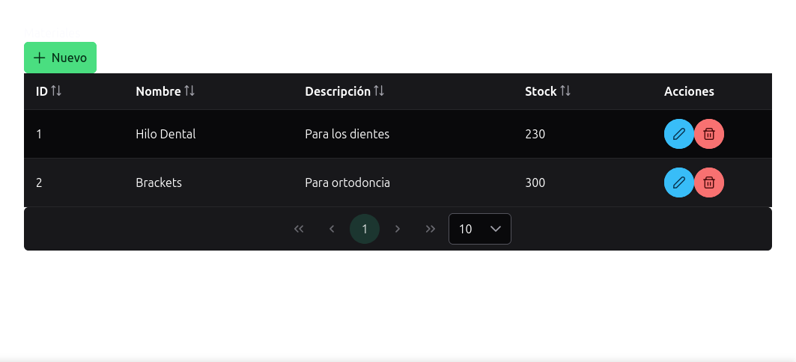  

#### 4.1.2 Crear Nuevo Material

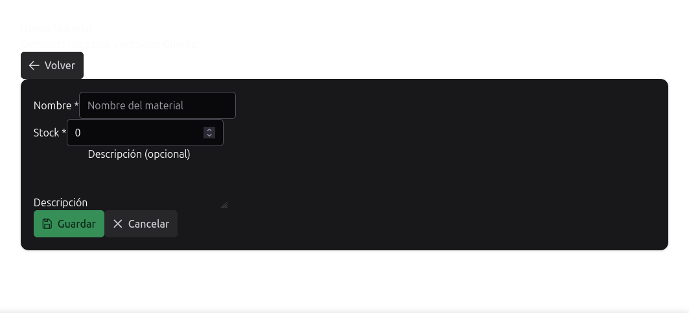  

---

## 5. Módulo de Pacientes

### 5.1 Gestión de Citas

#### 5.1.1 Listar Citas

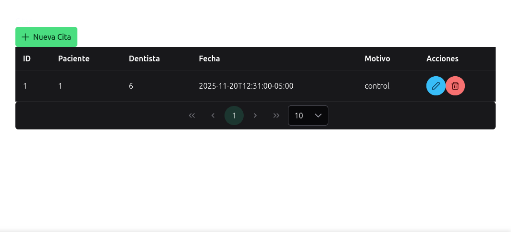  

#### 5.1.2 Crear Nueva Cita

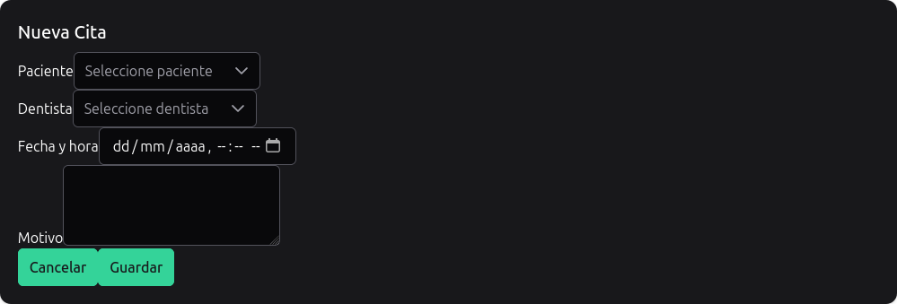  

**Campos del formulario:**
- **Paciente** (obligatorio) - Selector desplegable con lista de pacientes
- **Dentista** (obligatorio) - Selector desplegable con lista de dentistas
- **Fecha y Hora** (obligatorio) - Selector de fecha y hora
- **Motivo** (opcional) - Área de texto para describir el motivo de la cita

---

### 5.2 Gestión de Pacientes

#### 5.2.1 Listar Pacientes

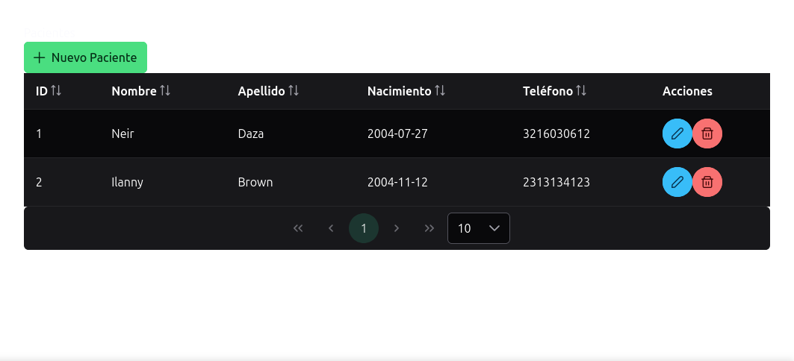 

#### 5.2.2 Crear Pacientes

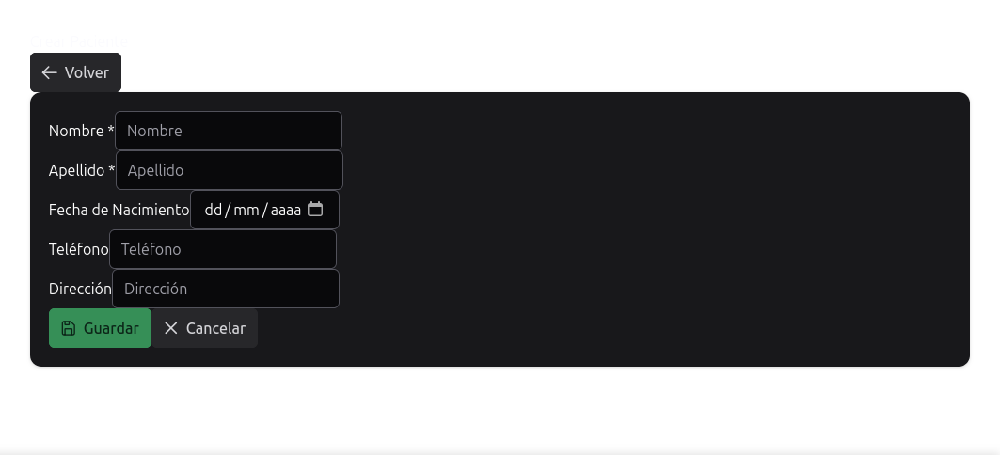 

**Campos del formulario:**
- **Nombre** (obligatorio) -  Área de texto para describir el nombre
- **Apellido** (obligatorio) -  Área de texto para describir el apellido
- **Fecha de Nacimiento** (opcional) - Selector de fecha
- **Teléfono** (opcional) - Área de texto para describir el teléfono
- **Dirección** (opcional) - Área de texto para describir la dirección

#### 5.2.3 Editar Pacientes

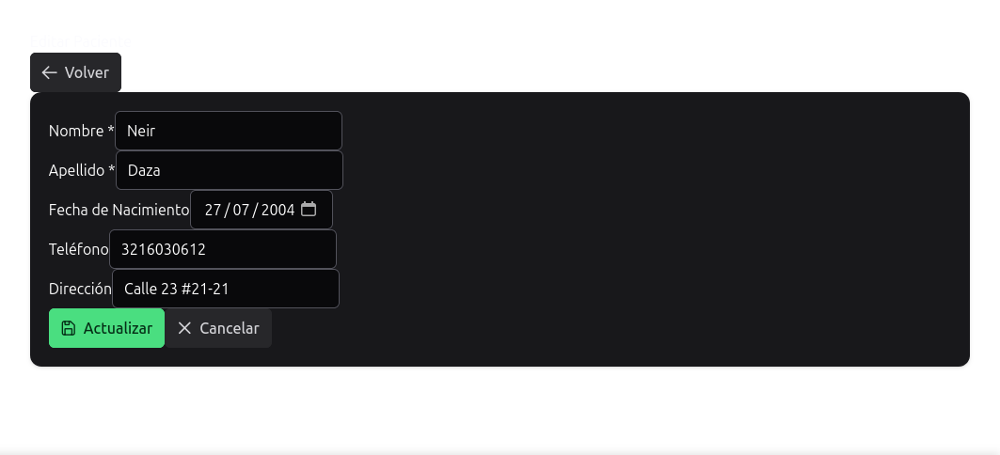 